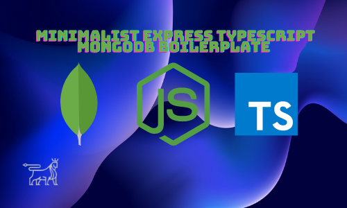

### Minimalist express-typescript-boilerplate


#### Available Scripts
```

- `tsc' - builds the tsc project to the dist folder
- `build` - cleans the previous build folder and rebuilds
- `clean' - removes the old dist folder
- `compile` - cleans/transpiles and starts the dist server
- `dev` - runs nodemon on the dist folder, 
          hot reloading on changes made in ts(cleans the old dist folder then rebuilds)
```

#### Features
Contains optional MongoDb connection via Mongoose, with sample Post model.
Contains folder structure for controllers, models, and routes